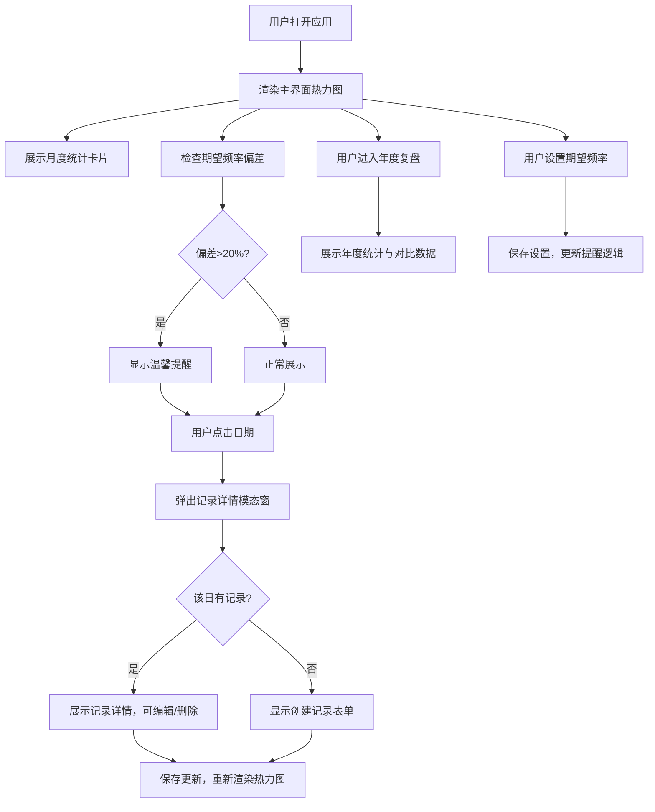

## 1. 产品概述

私密记录H5日历应用是一款专为情侣或亲密关系设计的日常记录工具，通过热力图可视化展示二人世界的点滴回忆。以温暖浪漫的设计风格，帮助用户追踪记录频率、回顾美好时光、培养持续记录的习惯。

- 核心用户群体：情侣、亲密伴侣、重视仪式感的个人用户
- 解决痛点：缺乏直观的记录追踪方式、难以回顾和量化感情历程、缺少温和的记录提醒机制

## 2. 核心功能

### 2.1 用户角色

| 角色 | 注册方式 | 核心权限 |
|------|----------|----------|
| 普通用户 | 直接使用（本地存储） | 浏览热力图、创建/编辑记录、设置期望频率、查看统计数据 |

### 2.2 功能模块

1. **主界面**：热力图日历、月度统计卡片、提醒入口、期望值设置入口
2. **记录详情**：模态窗口展示当日记录内容、支持编辑和删除
3. **年度复盘**：年度总览、月度对比、高频/低频月份标识、同比分析
4. **期望值设置**：设置期望频率范围、自动对比、趋势偏差提醒

### 2.3 页面详情

| 页面名称 | 模块名称 | 功能描述 |
|-----------|-------------|---------------------|
| 主界面 | 热力图日历 | 展示过去12个月每日记录，颜色深浅表示记录频次/评分，点击日期弹出详情模态窗 |
| 主界面 | 月度统计卡片 | 显示当月记录次数、平均评分、与上月对比（升/降/持平）、最高连续天数 |
| 主界面 | 温馨提醒 | 当实际频率与期望偏差超20%时显示温和提醒文案 |
| 主界面 | 期望值设置入口 | 点击展开设置面板，设置每周期望记录X-Y次 |
| 年度复盘页 | 年度总览 | 年总记录次数、月平均频率、最高/最低频月份 |
| 年度复盘页 | 年度对比 | 与上一年度数据对比，显示增长/下降百分比 |
| 记录详情模态窗 | 记录内容 | 展示/编辑日期、心情评分、文字记录、特殊标记 |

## 3. 核心流程

## 4. 用户界面设计

### 4.1 设计风格

- **主色调**：温暖玫瑰粉 (#FF6B9D) 作为主色，搭配蜜桃橙 (#FFA07A) 为辅色，营造浪漫温馨氛围
- **中性色**：象牙白背景 (#FFF9F5)，暖灰色文字系 (#5C4A4A, #8B7A7A)
- **热力图色阶**：5级递进色，从浅粉 (#FFE4EC) → 淡粉 (#FFB6CE) → 玫粉 (#FF87AB) → 深玫 (#FF5C8E) → 酒红 (#D63384)
- **按钮风格**：圆角胶囊按钮，主按钮带柔和渐变阴影，点击有微缩放反馈
- **字体**：标题使用优雅衬线字体（Playfair Display / Noto Serif SC），正文使用圆润无衬线（Noto Sans SC）
- **布局风格**：卡片式分层布局，充足留白，柔和阴影，圆角统一为 16px
- **图标风格**：Lucide 线性图标，统一描边 1.5px，尺寸和谐

### 4.2 页面设计概览

| 页面名称 | 模块名称 | UI 元素 |
|-----------|-------------|----------|
| 主界面 | 热力图日历 | 月份标签横向滚动、星期行标、5x7格子热力矩阵、颜色legend、悬浮tooltip、格子缩放动画 |
| 主界面 | 月度统计卡片 | 四宫格布局（次数/均分/环比/连续）、上下箭头趋势图标、数字渐变高亮、卡片悬浮阴影 |
| 主界面 | 温馨提醒 | 柔和暖黄渐变背景条、心跳图标、文字淡入动画、可关闭 |
| 主界面 | 期望值设置 | 底部滑出面板、双滑块选择器（X-Y次）、实时预览、保存动效 |
| 年度复盘页 | 年度总览 | 大数字统计卡、月度频次柱状图（玫瑰色渐变）、最高/低频月份徽章 |
| 年度复盘页 | 年度对比 | 同比环形进度图、上升/下降标签、增长百分比高亮 |
| 记录详情模态窗 | 记录内容 | 毛玻璃背景遮罩、居中卡片、星级评分组件、文本域textarea、保存/删除按钮、下拉滑入动画 |

### 4.3 响应式设计

- **移动端优先 (Mobile-first)**：针对 375px-428px 主流手机屏幕优化
- **断点策略**：sm (360px), md (768px), lg (1024px)
- **热力图适配**：小屏使用 4px 间距格子，中屏 6px，大屏 8px；月份标签可横向滚动
- **触摸优化**：所有可交互元素最小触控尺寸 44x44px，按钮点击区域扩展
- **安全区域**：适配 iPhone 刘海屏/灵动岛，使用 env(safe-area-inset-*) 内边距

### 4.4 动效设计

- **页面加载**：热力图格子逐个淡入（staggered fade-in，间隔 20ms）
- **卡片悬浮**：translateY(-2px) + 阴影加深的微交互
- **模态窗**：背景遮罩淡入 + 内容卡片从下方滑入 + 轻微弹性
- **数值变化**：数字滚动动画（count-up effect）
- **提醒出现**：从顶部滑入 + 轻微弹跳
- **设置面板**：底部抽屉式滑入，背景同步变暗
