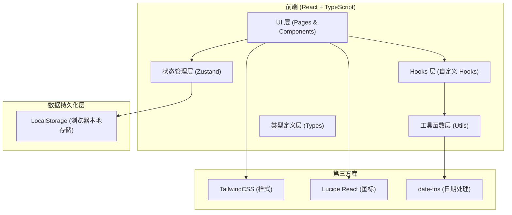
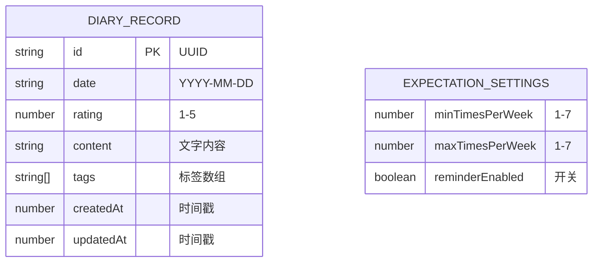

## 1. 架构设计



## 2. 技术说明

- **前端框架**：React@18 + TypeScript@5
- **构建工具**：Vite@5
- **样式方案**：TailwindCSS@3 + CSS Variables（主题色配置）
- **状态管理**：Zustand@4（轻量级，内置 persist 中间件实现本地持久化）
- **日期处理**：date-fns@3（轻量化、模块化、Tree-shaking 友好）
- **图标库**：Lucide React（线性风格、体积小、按需引入）
- **后端**：无（纯前端 H5 应用，所有数据存储于浏览器 LocalStorage）
- **数据库**：LocalStorage（通过 Zustand persist 中间件自动序列化/反序列化）
- **初始化工具**：vite-init（使用 react-ts 模板）

## 3. 路由定义

| 路由 | 目的 |
|-------|---------|
| / | 主界面（热力图日历 + 月度统计卡片 + 提醒 + 设置入口） |
| /review | 年度复盘页面（年度统计 + 月度对比 + 同比分析） |

注：记录详情通过模态窗口实现，不单独设置路由。期望值设置通过底部抽屉组件实现。

## 4. 类型定义（Type Schema）

```typescript
// 单条记录
interface DiaryRecord {
  id: string;                    // UUID
  date: string;                  // YYYY-MM-DD 格式
  rating: number;                // 1-5 星评分
  content: string;               // 文字记录内容
  tags: string[];                // 标签：如 "纪念日"、"旅行"、"日常"
  createdAt: number;             // 创建时间戳
  updatedAt: number;             // 更新时间戳
}

// 期望设置
interface ExpectationSettings {
  minTimesPerWeek: number;       // 每周最少期望次数
  maxTimesPerWeek: number;       // 每周最多期望次数
  reminderEnabled: boolean;      // 是否开启提醒
}

// 统计数据 - 月度
interface MonthlyStats {
  year: number;
  month: number;                 // 1-12
  totalCount: number;            // 记录总次数
  avgRating: number;             // 平均评分 (0-5)
  maxStreak: number;             // 最高连续记录天数
  compareToLastMonth: {
    countChange: 'up' | 'down' | 'same';
    countChangePercent: number;
    ratingChange: 'up' | 'down' | 'same';
  };
}

// 统计数据 - 年度
interface YearlyStats {
  year: number;
  totalCount: number;            // 年总记录数
  avgMonthlyCount: number;       // 月平均记录数
  highestMonth: { month: number; count: number };
  lowestMonth: { month: number; count: number };
  compareToLastYear: {
    direction: 'up' | 'down' | 'same';
    changePercent: number;
    lastYearCount: number;
  };
  monthlyBreakdown: { month: number; count: number; avgRating: number }[];
}

// 全局状态
interface AppState {
  records: DiaryRecord[];
  settings: ExpectationSettings;
  selectedDate: string | null;
  isDetailModalOpen: boolean;
  isSettingPanelOpen: boolean;
  showReminder: boolean;
}
```

## 5. 数据模型

### 5.1 数据模型 ER 图



### 5.2 LocalStorage 数据结构

```json
{
  "records": [
    {
      "id": "uuid-string",
      "date": "2025-06-15",
      "rating": 5,
      "content": "今天一起看了日落，很开心...",
      "tags": ["日常", "浪漫"],
      "createdAt": 1750000000000,
      "updatedAt": 1750000000000
    }
  ],
  "settings": {
    "minTimesPerWeek": 3,
    "maxTimesPerWeek": 5,
    "reminderEnabled": true
  }
}
```

## 6. 组件架构

```
src/
├── pages/
│   ├── Home.tsx              # 主页面（热力图+统计卡片）
│   └── Review.tsx            # 年度复盘页面
├── components/
│   ├── HeatmapCalendar/
│   │   ├── HeatmapCalendar.tsx   # 热力图日历主组件
│   │   ├── HeatmapCell.tsx       # 单格热力单元
│   │   └── HeatmapLegend.tsx     # 颜色图例
│   ├── MonthlyStatsCard.tsx      # 月度统计卡片
│   ├── YearlyStatsCard.tsx       # 年度统计卡片
│   ├── RecordDetailModal.tsx     # 记录详情模态窗
│   ├── SettingPanel.tsx          # 期望值设置抽屉
│   ├── ReminderBar.tsx           # 温馨提醒条
│   ├── RatingStars.tsx           # 星级评分组件
│   └── PageHeader.tsx            # 通用页面头
├── hooks/
│   ├── useHeatmapData.ts         # 热力图数据处理hook
│   ├── useMonthlyStats.ts        # 月度统计计算hook
│   ├── useYearlyStats.ts         # 年度统计计算hook
│   └── useExpectationCheck.ts    # 期望频率偏差检测hook
├── utils/
│   ├── dateUtils.ts              # 日期工具函数
│   ├── statsUtils.ts             # 统计计算工具
│   └── storageUtils.ts           # 存储工具
├── types/
│   └── index.ts                  # 全局类型定义
├── store/
│   └── useAppStore.ts            # Zustand 全局状态
├── App.tsx
├── main.tsx
└── index.css
```

## 7. 核心算法说明

### 7.1 热力图颜色分级算法
```
输入：指定日期的 rating (1-5) 和是否有记录
输出：5级色阶中的一级
规则：
  - 无记录 → Level 0 (空白/极浅)
  - rating=1 → Level 1
  - rating=2 → Level 2
  - rating=3 → Level 3
  - rating=4 → Level 4
  - rating=5 → Level 5
```

### 7.2 连续记录天数计算
```
遍历当月日期数组，维护当前连续天数 currentStreak 和最大值 maxStreak
- 有记录 → currentStreak++，并更新 maxStreak
- 无记录 → currentStreak = 0
```

### 7.3 期望频率偏差检测
```
最近4周实际记录次数 = count(records in last 28 days)
最近4周期望次数范围 = [min * 4, max * 4]
若: 实际次数 < min * 4 * (1 - 0.2)  → 触发提醒(低于期望下限80%)
或: 实际次数 > max * 4 * (1 + 0.2)  → 触发提醒(高于期望上限120%)
提醒文案: "最近似乎有些忙碌，记得留些二人世界的时间哦"
```

### 7.4 同比变化百分比计算
```
changePercent = ((今年 - 去年) / 去年) * 100%
direction: changePercent > 0 → up, < 0 → down, =0 → same
若去年为0且今年>0 → direction=up, changePercent=100
```
